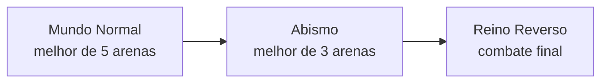
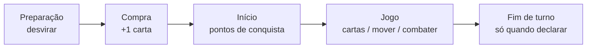

# Reino Reverso TCG — Game Design Document (GDD)

Documento de design consolidado para desenvolvimento.  
**Protótipo jogável:** `TcgPrototype` (Vite + TypeScript).

---

## 1. Visão geral

**Reino Reverso TCG** é um card game estratégico para **2 jogadores**, tema **fantasia / sobrenatural**. A partida não é um duelo linear de “bater no rosto”: o campo é dividido em **fases de mundo** e **controle de arenas**. O Líder não entra em combate direto na mesa (exceto regras futuras); ele representa a facção e sofre dano conforme o domínio territorial.

| Pilar | Descrição |
|-------|-----------|
| Território | Vencer disputas em arenas para avançar de fase |
| Economia | Essência (e depois Corrupção) para jogar cartas |
| Pressão | Líder com vida limitada; dano vem sobretudo de conquistas |
| Identidade | Cada Líder define facção e pool de cartas |

---

## 2. Estrutura da partida (macro)

A partida tem **3 grandes fases**, em sequência:



| Fase | Arenas em jogo | Vitória da fase | Vantagem do vencedor |
|------|----------------|-----------------|----------------------|
| **Mundo Normal** | 5 (2 por jogador + 1 neutra) | Dominar **3** arenas | Escolhe **2** arenas do Abismo |
| **Abismo** | 3 simultâneas | Dominar **2** arenas | Escolhe a arena do Reino Reverso |
| **Reino Reverso** | 1 arena | Ver seção 8 | Quem venceu o Abismo **começa** |

**Fim da partida completa:** quando um **Líder chega a 0 de vida** (em qualquer momento em que dano se aplique ao Líder).

> Protótipo: **Mundo Normal → Abismo → Reino Reverso** com escolha pós-fase e draft de arenas.

---

## 3. Líder e baralho

### 3.1 Líder

- Carta **fora do campo** (não é tropa em zona).
- Tem **habilidade ativa** própria (1× por turno).
- Define quais cartas de **facção** podem ir no baralho.
- Sofre dano conforme regras de cada fase (ver seção 7).
- Pode **evoluir** gastando **5 Corrupção** (fase principal, sem combate ativo).

| Constante | Valor |
|-----------|-------|
| Vida inicial | Definida pelo Líder (Noah: **10 HP**) |
| Custo de evolução | **5 Corrupção** |
| Corrupção máxima | **Por fase**: MN=5, Abismo=10, RR=sem limite |

#### Habilidades de Líder

| Líder | Facção | Habilidade | Quando |
|-------|--------|------------|--------|
| **Noah — o pugilista** (10 HP) | Delta | **Escudo** (2 Essência): protege 1 tropa aliada na arena; bloqueia o próximo dano (qualquer quantidade) | Durante combate |
| **Noah — o vampiro inverno** (10 HP) | Delta | **Cria do Inverno** (2 Essência): transforma tropa aliada em Cria do Inverno. Ao atacar: 1d6 par → congela alvo (attackSuppressed). Passiva: Crias que causam dano e sobrevivem curam o dano causado (vampirismo). | Durante combate |
| **Noah — o Delta da Empatia** (10 HP) | Delta | **Empatia** (1 Essência): marca tropa aliada com Empatia (ganha Protetor + Escudo). Passiva: ao morrer, aliados na mesma arena ganham +1/+1. | Combate ou fase principal |

#### Evolução de Líder

Na fase principal (sem combate), gastar **5 Corrupção** → evoluir para uma forma disponível.
Formas do Noah: pugilista (base) → vampiro inverno ou Delta da Empatia.

### 3.2 Baralho

| Regra | Valor |
|-------|--------|
| Tamanho mínimo | **40** cartas |
| Cópias por carta | Máximo **4** |
| Cartas de facção | Só com o Líder correspondente |
| Cartas neutras | Qualquer baralho |

### 3.3 Mulligan (início)

- Mão inicial: **5** cartas.
- **1 mulligan** por jogador por partida.
- Escolhe **quantas e quais** devolver; compra a **mesma quantidade** do baralho.

---

## 4. Zonas de jogo

| Zona | Função |
|------|--------|
| **Baralho** | Compra |
| **Mão** | Cartas jogáveis |
| **Deck esgotado** | Se precisar comprar e o baralho não tiver cartas suficientes → **derrota automática** |
| **Base** | Zona segura; tropas entram exaustas ao ser convocadas |
| **Arena** | Combate e conquista; máx. 3 tropas por jogador |
| **Espaço de Essência** | Cartas convertidas/sacrificadas viram mana (exiladas, visíveis) |
| **Descarte** | Cartas destruídas / descartadas |

### 4.1 Movimento (tropas)

- Da **mão → base**: ao convocar; tropa entra **exausta**.
- **Base ↔ arena** apenas (não arena ↔ arena sem efeito).
- Qualquer movimento **exausta** a tropa.
- Na **preparação**, tropas e Essência **desviram** (deixam de estar exaustas).

### 4.2 Tropas presas

Quando um jogador **conquista** uma arena (2 pontos de conquista), as tropas que estavam nela na conquista ficam **presas** — não podem mais se mover.

---

## 5. Turno do jogador

Ordem das fases em cada turno:



| Fase | O que acontece |
|------|----------------|
| **Preparação** | Desvira tropas e cartas de Essência exaustas |
| **Compra (Draw)** | Compra **1** carta do baralho |
| **Início** | Ganha pontos de conquista elegíveis; efeitos de início de turno (futuro) |
| **Jogo** | Alterna livremente: jogar cartas, mover, declarar combate. **Combate não encerra o turno** |
| **Fim de turno** | Só quando o jogador declara |

---

## 6. Economia — Essência

### 6.1 Essência (v1)

- Recurso principal para pagar custos.
- Cartas no **Espaço de Essência** não são descartadas ao pagar: ficam **exaustas (deitadas)**.
- Na **preparação** do dono, Essência exausta **desvira**.

### 6.2 Converter carta em Essência

- Algumas cartas têm símbolo **✦** (Essência).
- **1× por turno**: sacrificar da mão uma carta com ✦ → vai para o Espaço de Essência (+1 Essência disponível).
- Cada carta no Espaço conta como **1 ponto** de Essência para pagar custos.

### 6.3 Escolha pós-fase

Ao **terminar uma fase** (Mundo Normal ou Abismo), **cada jogador** escolhe o destino das **próprias** tropas ainda nas arenas (podem ser escolhas diferentes):

| Escolha | Efeito (só nas suas tropas em arena) |
|---------|--------|
| **1 — Essência** | Cada uma vira 1 carta no seu Espaço de Essência |
| **2 — Corrupção** | Destrói-as; **+1 Corrupção** por tropa (máx. **+3** nesta escolha) |
| **3 — Reciclar** | Voltam ao seu baralho e embaralham |

Ordem no protótipo: Jogador 1 escolhe, depois Jogador 2.

---

## 7. Combate

### 7.1 Declaração

- Declarado numa **arena** durante a fase de jogo.
- Requer tropas **dos dois** jogadores na mesma arena.
- Declarar combate numa arena **cancela** progresso de conquista pendente naquela arena (oponente atacou).
- Com tropas inimigas na mesma arena, **não é permitido encerrar o turno** sem declarar combate (em cada arena contestada).

### 7.2 Resolução

- Combate **até a morte** (não termina após um único golpe).
- Cada tropa pode **atacar uma vez por golpe** (só ataca no golpe em que seu jogador tem a vez).
- **Golpes alternados** entre jogadores (atacante → defensor → atacante…).
- Dentro de cada golpe: **um ataque por vez** — escolhe tropa → escolhe alvo → resolve na hora → próxima tropa.
- Em cada ataque, **alvo e atacante trocam dano no mesmo instante**; se o alvo morre, não revide em ataques seguintes contra ele.
- Várias tropas podem atacar o **mesmo** alvo em sequência (o segundo ataque só recebe revide se o alvo ainda estiver vivo).
- **Fim de turno bloqueado** se houver tropas inimigas na mesma arena: é obrigatório **declarar combate** primeiro.
- Efeitos futuros (ex.: **Taunt** / provocar) podem restringir a escolha de alvo.
- Entre golpes: efeitos “só em combate” (magias rápidas — futuro).
- Termina quando:
  - só restar tropas de **um** jogador, ou
  - **ambas** morrerem → arena fica sem tropas (neutra para presença).

### 7.3 Após combate

- Tropas mortas vão ao **descarte**.
- **Sobreviventes mantêm a vida atual** (não curam ao fim do combate); cura só por efeito de carta.
- No v1, **pontos de conquista em andamento não zeram** se ambos morrerem (ajuste de balanceamento futuro).

---

## 8. Conquista e dominação de arena

### 8.1 Pontos de conquista

Para ganhar **+1 ponto** em uma arena (no início do seu turno):

1. Você tem tropa aliada na arena.
2. No seu turno anterior, você **encerrou o turno** com ela lá (arena **sem** tropas inimigas).
3. No início do seu turno atual, a tropa **ainda está** na arena e **não há** tropas inimigas ali (arena não contestada).
4. O oponente pode ter **atacado** essa arena no turno dele; isso **não cancela** o ponto se você venceu o combate e manteve presença.

Com **2 pontos** na mesma arena → **conquista**.

### 8.2 Ao conquistar

- Arena fica **dominada por você** até o fim da **fase atual** (MN ou Abismo).
- **1 dano** no Líder inimigo (só no momento da conquista).
- Tropas presentes na conquista ficam **presas** na arena.
- **Nenhum jogador** pode enviar novas tropas para uma arena dominada (nem combater nela).

### 8.3 Empate / contestação

- Se houver tropa inimiga na arena, ela está **contestada** — não ganha ponto de conquista naquele ciclo.
- Combate é a forma de resolver presença inimiga.

### 8.4 Fim da fase (Mundo Normal / Abismo)

- Ao dominar **3** arenas (MN) ou **2** (Abismo), a fase **acaba na hora**.
- Aplica-se escolha pós-fase (seção 6.3); em seguida draft das arenas da próxima fase.

---

## 9. Reino Reverso

| Regra | Detalhe |
|-------|---------|
| Arenas | **1** arena escolhida pelo vencedor do Abismo |
| Dominação | **Não** há dominação permanente |
| Dano no Líder | Quem **vence o combate** causa **1** de dano ao Líder inimigo |
| Tropas sobreviventes | **Destruídas** ao fim do combate (não voltam à base), independente do vencedor |
| Fluxo | Deathmatch — combates repetem até um Líder a **0** |
| **Vácuo** | Ao **fim de cada combate**, se não houver tropa na sua **base** → **1** de dano no seu Líder |
| **Pressão na arena** | Se o oponente tem tropa na arena e você **não** tem, ao **encerrar seu turno** seu Líder leva **1** de dano (evita empate infinito na base) |
| Dano máximo / round | Até **2** no Líder (1 vitória + 1 vácuo); pressão na arena é dano **extra** fora do combate |
| Iniciativa | Começa quem **venceu o Abismo** |

---

## 10. Arenas (Mundo Normal)

### 10.1 Setup

- Cada jogador escolhe **2** cartas de arena.
- **1 arena neutra** fixa entra sempre: *Ruas de São Paulo* (sem efeito).
- Total: **5** arenas no campo.
- Arenas do **Mundo Normal** só podem ser escolhidas na fase MN; **Abismo** e **Reino Reverso** terão pools próprios (futuro).

### 10.2 Arenas do Mundo Normal (protótipo)

| Arena | Efeito |
|-------|--------|
| **Ruas de São Paulo** | Neutra padrão — sem efeito |
| **Bar do João** | Magias não podem ser usadas nesta arena (flag ativa quando magias existirem) |
| **Estação da Luz** | Ao declarar combate: preenche espaços vazios de ambos os jogadores com tokens **Gárgula 1/1** |
| **Colégio Aurélio de Camargo** | Ao dominar: embaralha **Susej — o arauto da ignorância** no baralho (carta em desenvolvimento) |
| **Ringue do Colecionador** | Ao declarar combate: uma tropa aleatória na arena ganha **+1/+1 permanente** |
| **Mansão dos Omegas** | Ao dominar: compra **2** cartas |
| **Sanatório São Augustinho** | Ao **fim de cada golpe** (rodada de ataques): **1 de dano** em todas as tropas vivas na arena — inclusive no golpe que encerra o combate |
| **Templo das Sombras** | Conquista com **3** pontos; ao dominar: **+1 Corrupção** (máx. 3) |

### 10.3 Arenas do Abismo (protótipo)

Pool de **4** arenas; setup: vencedor escolhe **2**, perdedor escolhe **1** (3 ativas). Vitória da fase: **2** domínios.

| Arena | Efeito |
|-------|--------|
| **Armazém do Colecionador** | Tropas não saem desta arena pelo movimento normal |
| **Cidade das Curvas** | Alvo do ataque em combate é **aleatório** |
| **Prisão do Conglomerado** | Tropas que morrem aqui são **exiladas** |
| **Castelo de Pedra Rubra** | Magias que afetam a arena custam **1 a menos** |

### 10.4 Reino Reverso (protótipo)

Pool de **4** arenas; vencedor do Abismo escolhe **1** e **começa** a fase.

| Arena | Efeito |
|-------|--------|
| **Arena do Reino Reverso** (neutra) | Deathmatch padrão (regras §9) |
| **Vácuo Eterno** | Vácuo ao fim do combate: base vazia = **2** de dano |
| **Salão dos Lordes** | Ambos zeram a arena → **cada** Líder leva 1 |
| **Trono Negro** | Só o **perdedor** do combate sofre Vácuo |

---

## 11. Tipos de carta (roadmap)

| Tipo | Status |
|------|--------|
| **Tropa** | v1 — ataque, vida, custo em Essência; algumas com ✦ |
| **Magia** | Piloto v1 — Encore, Pele de Ferro, Caldeirão de Sangue (ver §11.1) |
| **Artefato** | Planejado (ex.: Poço de Essência, Estandarte…) |
| **Equipamento** | Equipa em tropa aliada na fase principal (+ATK/+HP) |
| **Líder** | Fora do campo; define baralho |

Recursos planejados além de Essência: **Corrupção** (cartas mais agressivas).

### 11.1 Velocidades de carta

| Velocidade | Quando pode jogar |
|------------|-------------------|
| **Padrão** | No **seu turno** (fase principal) **ou** nas **fases de magia** do combate |
| **Combate** | **Somente** nas fases de magia do combate (não no turno normal) |
| **Rápida** | Qualquer momento (seu turno, turno do adversário, fase de magias ou golpe de combate) |

### 11.2 Fluxo de combate (com fases de magia)

1. Combate declarado → **Fase de magias 1** (ambos passam ou lançam magias)
2. **Golpe 1** (ataques alternados)
3. **Fase de magias 2** → **Golpe 2** → … até o fim

### 11.3 Magias piloto (protótipo)

| Magia | Velocidade | Custo | Alvo | Efeito |
|-------|------------|-------|------|--------|
| **Encore** | Padrão | 2 | Tropa aliada (base no turno; arena no combate) | Se atacada: 1d6 ímpar = ataque erra |
| **Pele de Ferro** | Padrão | 2 | Tropa aliada | +2 vida permanente |
| **Caldeirão de Sangue** | Combate | 3 | Tropa inimiga **só na arena** do combate | 1d6 par = 2 de dano |
| **Lufada de Vento** | Rápida | 2 | Tropa na arena (aliada ou inimiga) | Volta à **base do dono**, exausta |

- Uma aura por tropa (Encore / Pele não empilham).
- Lufada exige espaço na base do dono da tropa (máx. 3).
- Bar do João bloqueia magias na arena durante todo o combate.

### 11.4 Palavras-chave (tropas)

Efeitos ao morrer usam `deathEffect` — **não** são `spellEffect` (Bar do João não bloqueia).

| Palavra | Efeito |
|---------|--------|
| **Protetor** | Inimigos devem atacar Protetores na arena antes das outras tropas (só ataques; magias ignoram). Cidade das Curvas: alvo aleatório entre **todas** as tropas inimigas. |
| **Investida** | Entra na base **pronta** (pode mover no mesmo turno; ainda não ataca no combate no turno em que entrou, salvo regra futura). |
| **Testamento** | Dispara `deathEffect` ao morrer (ex.: comprar 1, 1 de dano no Líder inimigo). |
| **Eco** | Ao morrer: uma tropa aliada na **base** fica pronta. |
| **Vincular** | Ao causar dano em combate: alvo **não pode se mover** até a preparação do dono dele. |
| **Silêncio** | Não pode receber Encore, Pele de Ferro ou outras magias presas. |
| **Fatiar** | Dano excedente ao eliminar um inimigo continua em outro inimigo **legal** na mesma arena, no mesmo ataque (respeita Protetor). |
| **Voar** | Pode mover diretamente entre arenas (não só base ↔ arena); ao voar, fica exausta. Regras de “não sair” da arena ainda se aplicam. |

Cartas piloto no JSON: Escudeiro do Pacto, Mensageiro Alado, Último Suspiro, Eco Persistente, Corrente Etérea, Vazio Antimágia, Muralha de Ossos, **Ceifador Laminar** (Fatiar), **Falcão do Abismo** (Voar).

---

## 12. Protótipo v1 — escopo implementado

Checklist do que o código atual cobre:

- [x] 2 jogadores local (hotseat)
- [x] Setup: escolha de 2 arenas + neutra
- [x] Mulligan parcial
- [x] Mão 5, deck mín. 40 (starter: 60), cópias no JSON
- [x] Turno: Preparação → Compra → Início → Jogo
- [x] Essência: converter ✦ (1×/turno), exaurir ao pagar, desvirar na preparação
- [x] Tropas: convocar na base, mover base↔arena, exaustão
- [x] Combate por rodadas até limpar arena
- [x] Conquista (2 pontos), dominação, dano ao Líder, tropas presas
- [x] Vitória: 3 domínios (MN) ou Líder a 0
- [x] UI: J2 mão acima da base; J1 base acima da mão
- [x] Efeitos de arena do Mundo Normal (8 cartas + neutra)
- [x] Corrupção rastreada (ganho no Templo das Sombras)
- [x] Tropas derrotadas vão ao descarte (removem do campo)
- [x] Transição MN → Abismo → Reino Reverso (vitória por domínios na fase)
- [x] Escolha pós-fase (Essência / Corrupção / Reciclar)
- [x] Draft de arenas do Abismo (vencedor 2 + perdedor 1) e RR (vencedor 1)
- [x] Reino Reverso: dano ao Líder ao vencer combate, tropas à base, vácuo
- [x] Magias piloto (Encore, Pele de Ferro, Caldeirão de Sangue)
- [x] Gasto de Corrupção em cartas
- [x] Líder com habilidade ativa (Escudo do Noah)
- [x] Evolução de Líder (5 Corrupção → nova forma)
- [x] 3 formas do Noah (pugilista, vampiro inverno, Delta da Empatia)
- [x] Facção Delta
- [x] vs CPU (IA com combate, magias e fallback em arena contestada)
- [x] 1v1 online (salas, polling, fog of war, reconexão por sessão)
- [x] Magias rápidas e habilidades reativas do Líder durante combate
- [x] Artefato piloto (Altar Sombrio — sacrificar tropa por Corrupção)
- [x] Corrupção máxima por fase: MN=5, Abismo=10, RR=sem limite
- [x] Keywords piloto: Protetor, Testamento, Eco, Silêncio, Fatiar, Voar

Fora do protótipo atual:

- [x] Equipamentos piloto (Lâmina do Pacto, Escudo Delta, Amuleto Sombrio, Corrente de Ferro)
- [ ] UI de deckbuilder com validação por Líder
- [ ] Pools completos de arenas Abismo/RR além do piloto

### Como rodar

```bash
cd C:\Users\Guilherme\Desktop\Faculdade\projetos\TcgPrototype
npm install
npm run dev
```

Título da aba: **Reino Reverso TCG — Protótipo v1.1**

### Constantes no código

Arquivo `src/game/types.ts`:

- `LEADER_MAX_HP = 15`
- `MAX_TROOPS_PER_ZONE = 3`
- `INITIAL_HAND_SIZE = 5`
- `CARDS_DRAW_PER_TURN = 1`
- `DOMINATIONS_TO_WIN_PHASE = 3`

---

## 13. Referência rápida — fluxo de uma partida (MN)

1. Escolher arenas → mulligan → Jogador 1 começa.
2. No turno: desvirar → comprar 1 → checar conquistas → jogar (Essência / tropas / combate) → fim de turno.
3. Repetir até alguém dominar **3** arenas ou reduzir Líder a 0.
4. (Futuro) Escolha pós-fase → Abismo → Reino Reverso.

---

## 14. Glossário

| Termo | Significado |
|-------|-------------|
| **Exausta / deitada** | Não pode agir até a próxima preparação |
| **Contestada** | Há tropa inimiga na mesma arena |
| **Conquista** | 2 pontos de controle na arena |
| **Dominada** | Arena concede vitória de fase; tropas que conquistaram ficam presas |
| **Espaço de Essência** | Zona de mana; cartas exiladas, exaustas ao gastar |
| **✦** | Símbolo: carta pode ser convertida em Essência |

---

## 15. Histórico do documento

| Data | Nota |
|------|------|
| 2026-05 | GDD inicial consolidado a partir do design com o autor |

---

*Este documento é a fonte de verdade para regras de design. Ajustes de balanceamento devem atualizar este arquivo e as constantes em `types.ts`.*
